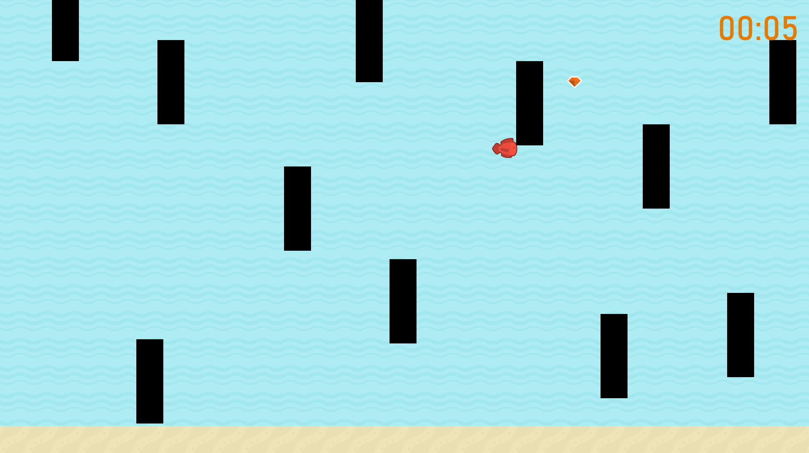

# FLAPPY FISH
### *A Fish Pygame*
#
### Description:
Originally inspired by Flappy Bird, this game is designed to test
your reaction time, finger agility, and focus. You play as a fish
who needs to swim fast to dodge the oncoming obstacles for as long
as possible before you get swept away. You can increase your
swim speed by collecting power-ups. Just keep swimming!
#
### Instructions:
1) Avoid Oncoming Obstacles
   - Use the arrow keys to move up, down, left, and right to avoid the
   obstacles

2) Collect Power-Ups
    - Collect the power-ups to increase your swim speed

3) Swim as Long as You Can
    - Keep swimming and dodging obstacles to earn a high score
#
### Credits:
Thank you to my classmate that helped make this game possible.
- Riley Haugen
- Rachel Haung

### Gameplay:
